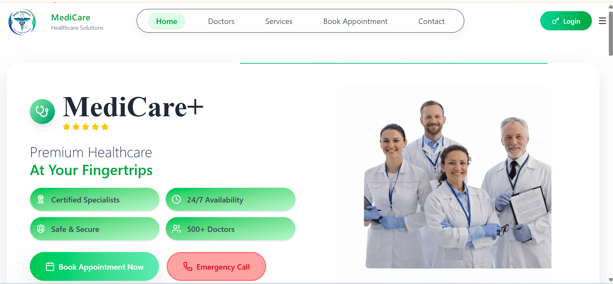
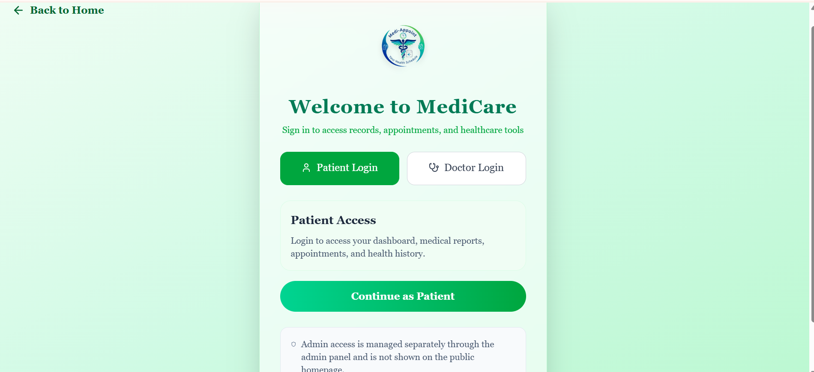

# 🏥 MediCare - Full Stack Hospital Management System

🚀 A production-ready healthcare platform where patients, doctors, and admins interact securely in a real-world hospital ecosystem.

---

## 🌟 Project Overview

**MediCare** is a full-stack healthcare system designed to solve real-world hospital challenges:

* 📅 Book doctor appointments
* 🧪 Book medical services (lab tests, diagnostics)
* 📄 Upload & access medical reports
* 🧠 Maintain centralized patient medical history
* 🏥 Enable hospital-based secure data sharing

> 🎯 Goal: Build a scalable **hospital chain system** similar to Fortis/Apollo where patient data is securely accessible across branches.

---

## 🎯 Key Features

### 👤 Patient Panel

* 🔐 Authentication (Clerk)
* 📅 Book Doctor Appointment (Online + Cash)
* 🧪 Book Services (Blood Test, etc.)
* 📋 View My Appointments
* 📄 Upload & View Medical Reports
* 🧑‍⚕️ View Doctor Details
* 📊 Patient Dashboard

---

### 👨‍⚕️ Doctor Panel

* 🔐 Secure Login (JWT)
* 📅 View Assigned Appointments
* 🔄 Manage Appointment Status:

  * Confirmed
  * Cancelled
  * Completed
* 🧠 View Patient Medical History
* 🏥 Hospital-based data filtering

---

### 🛠️ Admin Panel

* ➕ Add Doctor (with schedule & hospital)
* 👨‍⚕️ Manage Doctors
* 📅 Manage Appointments
* 🧪 Manage Services
* 📊 View Service Bookings
* ⚙️ System Control Dashboard

---

## 🧠 Core System Logic (USP 🚀)

### 🔐 Hospital-Based Data Access System

* Doctors can ONLY access patient data of their **own hospital**

#### Example:

* 🏥 Fortis Doctor → can see Fortis patient data
* 🏥 Apollo Doctor → ❌ cannot access Fortis data

👉 Ensures:

* Data privacy 🔒
* Real-world hospital chain simulation 🏥
* Scalable architecture 📈

---

## 💳 Payment System

* 💵 Cash Booking → Pending / Confirmed
* 💳 Online Payment → Stripe Integration
* 🔁 Payment Verification System implemented

---

## 📊 Tech Stack

### Frontend

* React (Vite)
* Tailwind CSS

### Admin Panel

* React (Vite)

### Backend

* Node.js
* Express.js

### Database

* MongoDB Atlas (Mongoose)

### Authentication

* Clerk (Patient)
* JWT (Doctor)

### Storage

* Cloudinary (Images + Reports)

### Payment

* Stripe

---

## 📁 Project Structure

```
admin/
frontend/
backend/
```

> ⚠️ Folder structure is strictly maintained (no unnecessary refactoring)

---

## 🔥 Advanced Features Implemented

* ✅ Full Authentication System (Clerk + JWT)
* ✅ Appointment Booking System
* ✅ Service Booking System
* ✅ Stripe Payment Integration
* ✅ Report Upload System (Cloudinary)
* ✅ Patient Dashboard
* ✅ Doctor Dashboard
* ✅ Admin Panel
* ✅ Appointment Status Management
* ✅ Hospital-based Data Security Logic
* ✅ Dynamic UI (React + Tailwind)

---

## 🎥 Demo (Recommended)

👉 Add your demo video here
👉 Example:

```
https://your-demo-link.com
```

---
## 📸 Screenshots

### 🏠 Home Page


### 🔐 Role Based Login


### 👤 Dashboard


### 📅 Appointments


### 📄 Reports


---

## 🧠 Learning Outcomes

* Full Stack Development
* REST API Design
* Authentication & Authorization
* Payment Integration (Stripe)
* Cloud Storage Handling
* Real-world Problem Solving
* Scalable System Design

---

## 🌍 Future Scope

* 🌐 Medical Tourism Platform
* 🧠 AI-based Disease Prediction
* 📈 Hospital Ranking System
* 🔍 SEO-based Healthcare Discovery
* 🤝 Lead Generation System

---

## 👩‍💻 Developer Note

This project is built as a **placement-ready real-world healthcare system** with scalable architecture and industry-level practices.

> Focus: Practical learning + real-world implementation

---

## ⭐ Support

If you found this project useful, consider giving it a ⭐ on GitHub!

---
